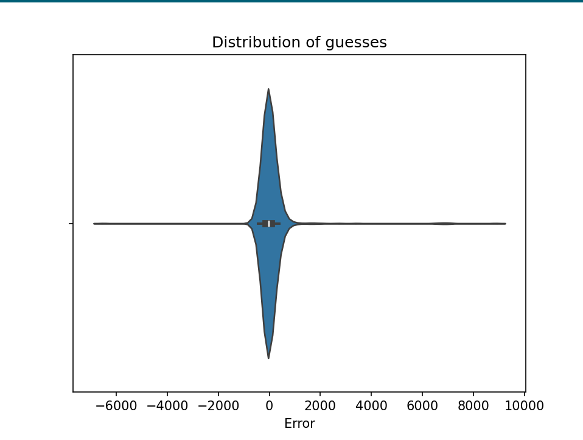

# scorekeeper-sam
Some light data science in the afternoon to determine if the AC vents were impacting the consistency of the drone scoring to a statistically significant degree.


## Data
 - [FTCCMP1EDIS_matches.csv](FTCCMP1EDIS_matches.csv)
 - [FTCCMP1EDIS_rankings.csv](FTCCMP1EDIS_rankings.csv)
 - [FTCCMP1FRAN_matches.csv](FTCCMP1FRAN_matches.csv)
 - [FTCCMP1FRAN_rankings.csv](FTCCMP1FRAN_rankings.csv)
 - [FTCCMP1JEMI_matches.csv](FTCCMP1JEMI_matches.csv)
 - [FTCCMP1JEMI_rankings.csv](FTCCMP1JEMI_rankings.csv)
 - [FTCCMP1OCHO_matches.csv](FTCCMP1OCHO_matches.csv)
 - [FTCCMP1OCHO_rankings.csv](FTCCMP1OCHO_rankings.csv)

## Code
 - [script to web scrape](get.py) the data you see above
 - [script to analyze](analyze_scores.py) the data and try to output useful stats

## Findings
First, part of the script output:
```
FTCCMP1FRAN mean: 26.285714285714285
FTCCMP1FRAN field_1_red mean: 23.428571428571427 var: 18.406498087432336
FTCCMP1FRAN field_1_blue mean: 26.714285714285715 var: 18.472182656391674
FTCCMP1FRAN field_2_red mean: 27.714285714285715 var: 18.740905316742232
FTCCMP1FRAN field_2_blue mean: 27.285714285714285 var: 18.40930991404586

FTCCMP1JEMI mean: 29.107142857142858
FTCCMP1JEMI field_1_red mean: 28.428571428571427 var: 18.465456530671762
FTCCMP1JEMI field_1_blue mean: 29.857142857142858 var: 17.65144467075722
FTCCMP1JEMI field_2_red mean: 28.571428571428573 var: 20.591662466809183
FTCCMP1JEMI field_2_blue mean: 29.571428571428573 var: 17.39862682285332

FTCCMP1EDIS mean: 23.0
FTCCMP1EDIS field_1_red mean: 23.714285714285715 var: 19.19929260256542
FTCCMP1EDIS field_1_blue mean: 24.857142857142858 var: 18.157352257247993
FTCCMP1EDIS field_2_red mean: 20.428571428571427 var: 17.56443328918375
FTCCMP1EDIS field_2_blue mean: 23.0 var: 17.96534506176839

FTCCMP1OCHO mean: 27.964285714285715
FTCCMP1OCHO field_1_red mean: 27.714285714285715 var: 16.521521192852667
FTCCMP1OCHO field_1_blue mean: 29.571428571428573 var: 20.461042111935996
FTCCMP1OCHO field_2_red mean: 30.0 var: 19.486152645597752
FTCCMP1OCHO field_2_blue mean: 24.571428571428573 var: 18.469380401690803


confidence that each location is different that the average other location:
EDIS field_1_blue        0.02
OCHO field_2_blue        0.042499999999999996
EDIS field_1_red         0.09500000000000001
FRAN field_1_red         0.13166666666666668
EDIS field_2_blue        0.1525
JEMI field_1_red         0.165
FRAN field_1_blue        0.17
JEMI field_2_red         0.18
FRAN field_2_red         0.2
OCHO field_1_red         0.2
JEMI field_2_blue        0.22
OCHO field_1_blue        0.22
JEMI field_1_blue        0.25833333333333336
OCHO field_2_red         0.27666666666666667
FRAN field_2_blue        0.29
EDIS field_2_red         0.5660000000000001
```

Our most promising result is the last line in the above block, which means that the Edison Division field #2's red side (EDIS field_2_red) had a 56.6% chance to be significantly different than the rest of the locations. This is not very promising, since you usually look for 95% confidence. 56.6% just means we have a "false alarm" 43.4% of the time, which is still very high.

However, we are assuming all teams try to score the drone and they all have equal skill levels. If we correct for this by taking into account the rankings for each division, this may or may not change the result. We have all the ranking and match data in csv format in this repo so if anyone feels like crunching the numbers, go for it and let us know!

## Bonus
Data science on the guesses people put in for [how many among us in the jar](https://github.com/FTC7393/guess-and-photo-booth) game


```
Mean 48.75240715268225
Tukey's robust mean (outliers filtered): -132.0
Median: -15.0
Std. Deviation: 710.0706335182365 
```

Number of guesses is on the y axis and error is plotted on the x axis, so 0 means they got it exactly right, negative means they guessed too low, and positive means too high. Really interesting to see how it follows a smooth distribution.
